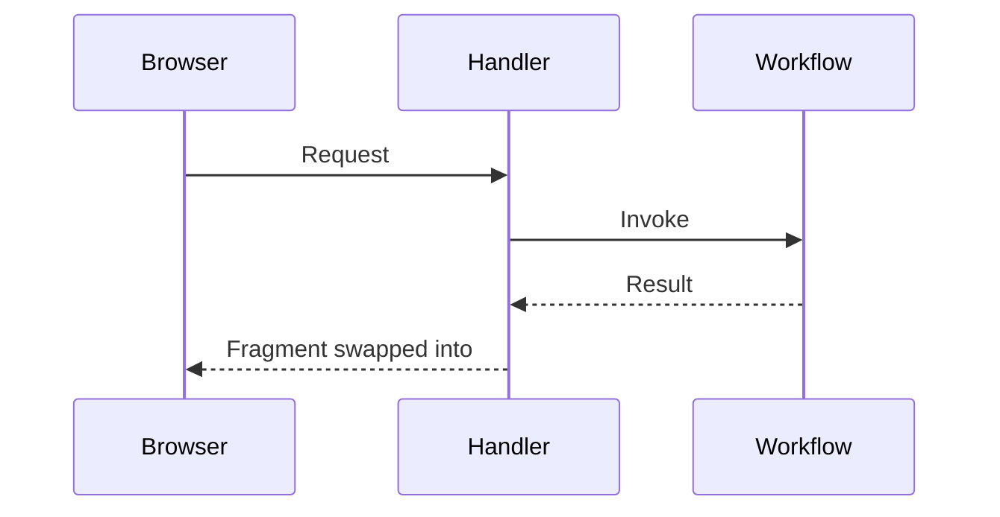

## Summary

<!-- What changes and why. Link the OpenSpec change or issue when there is one. -->

## Sequence diagram

<!--
Include when the change alters a request/response path, an HTMX interaction, or a flow
across components or background work. Name the real handlers, workflows, and swap targets.
Delete this section for documentation, configuration, dependency, formatting, and
refactor-only changes.


-->

## Verification

<!-- Commands run and their results, including Playwright when browser behaviour changed. -->
```
