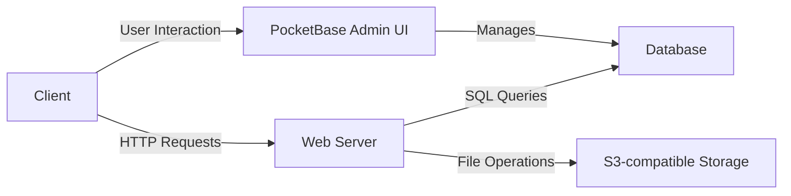

# Software Design Document: Web Gallery of Art

## 1. Introduction

This document outlines the software design for the Web Gallery of Art (WGA) project. The WGA is a web application that allows users to browse a collection of paintings, sculptures, and other forms of art. It aims to modernize the original Web Gallery of Art website by providing a responsive, user-friendly experience with the same rich content.

## 2. Technologies Used

The project leverages the following core technologies:

*   **Backend:**
    *   **Go (Golang):** Programming language used for the backend logic.
    *   **PocketBase:** An open-source backend-as-a-service (BaaS) written in Go. It provides data persistence (SQLite database), real-time subscriptions, user authentication, an admin UI, and a REST-ish API.
*   **Frontend:**
    *   **htmx:** A JavaScript library that allows access to modern browser features directly from HTML, enabling dynamic page updates without complex JavaScript.
    *   **TailwindCSS:** A utility-first CSS framework for rapidly building custom user interfaces.
    *   **DaisyUI:** A component library for TailwindCSS that provides pre-styled components.
    *   **Templ:** A Go library for writing HTML components and pages using Go syntax, which are then compiled into optimized Go code.
    *   **TypeScript/JavaScript:** Used for custom client-side enhancements and interactions (`resources/js/app.ts`).
*   **Build & Development Tools:**
    *   **Bun:** A fast JavaScript all-in-one toolkit used for managing frontend dependencies, running scripts, and bundling assets.
    *   **Goreleaser:** A tool for building and releasing Go applications.
    *   **Docker:** Used for containerizing the application and its services (like MinIO and Mailpit for local development).
    *   **Devenv (Nix):** Provides a reproducible development environment.
*   **External Services:**
    *   **S3-compatible storage:** Used for storing images and other large assets.
    *   **SMTP Service:** For sending emails (e.g., postcards, notifications).

## 3. System Architecture

### 3.1. Overview

The system follows a client-server architecture:

*   **Client (Web Browser):** Renders HTML pages served by the backend. Uses htmx for dynamic updates and JavaScript for enhancements.
*   **Web Server (Go/PocketBase):**
    *   Handles incoming HTTP requests.
    *   Serves HTML pages generated by `templ`.
    *   Interacts with the PocketBase framework for database operations, authentication, and other backend tasks.
    *   Serves static assets (CSS, JS, images not on S3).
*   **Database (SQLite via PocketBase):** Stores application data, including information about artists, artworks, users, guestbook entries, etc. PocketBase provides the interface to this database.
*   **S3-compatible Storage:** Stores larger media files, primarily images of artworks.
*   **PocketBase Admin UI:** A built-in web interface provided by PocketBase for managing collections (database schema), records, users, and system settings.

### 3.2. Backend

*   **PocketBase:**
    *   **Core Framework:** The application is built as a PocketBase executable. PocketBase handles the server lifecycle, request routing (extensible via Go), and provides core services.
    *   **Data Persistence:** Manages the SQLite database, providing an ORM-like interface and migration tools. Collections are defined in the PocketBase Admin UI and can be interacted with via Go code (see `models/`).
    *   **Admin Interface:** Offers a web-based UI for managing data and system settings.
*   **Request Handling (`handlers/`):**
    *   The `handlers/` directory contains Go packages responsible for handling specific HTTP routes.
    *   `handlers/main.go` registers these route handlers with the PocketBase application.
    *   Handlers typically fetch data (using `models/` or direct PocketBase DAO calls), process it, and render HTML responses using `templ` templates.
*   **Data Models (`models/`):**
    *   Go structs in the `models/` directory define the structure of data stored in PocketBase collections (e.g., `Artist`, `Artwork`). These structs often include methods for querying the database.
    *   Migrations (`migrations/`) are Go files that define schema changes and are managed by PocketBase's migration tool.
*   **Background Tasks/Cronjobs (`crontab/`):**
    *   The `crontab/` directory contains code for scheduled tasks, such as sitemap generation or postcard processing. These are registered with PocketBase's cron scheduler.
*   **Hooks (`hooks/`):**
    *   The `hooks/` directory contains code that responds to PocketBase lifecycle events (e.g., before/after record creation/update/deletion).

### 3.3. Frontend

*   **Templating (`assets/templ/`):**
    *   HTML pages and components are written as `.templ` files. These are Go functions that generate HTML.
    *   The `templ generate` command compiles these files into Go code, which is then used by the request handlers to render responses.
    *   Layouts (`assets/templ/layouts/`) define the basic page structure, and components (`assets/templ/components/`) are reusable UI elements.
*   **Client-side Logic:**
    *   **htmx:** Used extensively to enhance user interactions by making partial page updates. Attributes like `hx-get`, `hx-post`, `hx-target`, `hx-swap` are used in the HTML generated by `templ` to trigger server requests and update parts of the DOM.
    *   **JavaScript (`resources/js/app.ts`):** Custom JavaScript (compiled from TypeScript) is used for functionalities that htmx doesn't cover, such as initializing third-party libraries (e.g., image viewers, rich text editors) or complex UI interactions.
*   **Styling:**
    *   **TailwindCSS:** Provides utility classes used directly in the `templ` files to style elements.
    *   **DaisyUI:** Offers pre-built components (like buttons, cards, modals) that are styled with TailwindCSS, simplifying development.
    *   Custom CSS is defined in `resources/css/style.pcss` and processed by PostCSS.

### 3.4. Asset Pipeline

*   **Frontend Assets (`resources/`):**
    *   `resources/js/app.ts`: Main TypeScript file for client-side scripting.
    *   `resources/css/style.pcss`: Main PostCSS file for custom styles and TailwindCSS imports.
*   **Build Process:**
    *   `bun install`: Installs frontend dependencies.
    *   `bun run dev` or `bun run build`: Compiles TypeScript to JavaScript, processes PostCSS/TailwindCSS into `assets/public/css/style.css`.
    *   `templ generate`: Compiles `.templ` files into Go code.
    *   Static assets (images, fonts, compiled CSS/JS) are typically placed in `assets/public/` and served directly by PocketBase.

## 4. Key Features and Modules

The application is organized into several functional modules, primarily reflected in the `handlers/` directory structure:

*   **Home (`handlers/home.go`):** Displays the main landing page.
*   **Artists (`handlers/artist.go`, `handlers/artists.go`):** Allows browsing and viewing details of artists.
*   **Artworks (`handlers/artworks/`):** Enables searching, filtering, and viewing details of artworks.
*   **Inspire (`handlers/inspire/`):** Provides features for discovering art, potentially through random selections or curated lists.
*   **Postcards (`handlers/postcards/`):** Allows users to create and send digital postcards featuring artworks.
*   **Guestbook (`handlers/guestbook.go`, `handlers/guestbook/`):** A feature for users to leave comments.
*   **Feedback (`handlers/feedback/`):** Allows users to submit feedback about the site.
*   **Music (`handlers/musics.go`):** Provides access to related musical pieces.
*   **Static Pages (`handlers/static.go`):** Serves static content pages (e.g., About, Terms of Service).
*   **Contributors (`handlers/contributors.go`):** Likely displays a list of contributors to the project or content.

## 5. Data Storage

### 5.1. Database

*   **PocketBase (SQLite):** PocketBase uses an embedded SQLite database by default to store all application data.
*   **Schema:** The database schema is defined and managed through PocketBase's Admin UI or via migration files (`migrations/`). Key collections include:
    *   `artists`: Information about artists.
    *   `artworks`: Details about individual artworks.
    *   `schools`: Art schools or movements.
    *   `art_periods`: Historical art periods.
    *   `forms`: Art forms (e.g., painting, sculpture).
    *   `types`: Specific types of art.
    *   `glossary`: Definitions of art terms.
    *   `guestbook`: Entries from the guestbook.
    *   `postcards`: Data for sent postcards.
    *   `feedbacks`: User feedback submissions.
    *   `static_pages`: Content for static pages.
    *   `musics`: Information about musical pieces.
    *   `users`: (Managed by PocketBase) For user accounts if authentication is used beyond admin.

### 5.2. File Storage

*   **S3-compatible Object Storage:** Used for storing artwork images and potentially other large static assets. The application is configured with S3 credentials (`WGA_S3_*` environment variables).
*   **Local `wga_data/storage`:** During local development or if S3 is not configured, PocketBase can store files locally in this directory.

## 6. Build, Testing, and Deployment

### 6.1. Local Development Setup

*   **Prerequisites:** Go, Bun, Templ, Goreleaser (as per `README.md`).
*   **Environment Variables:** A `.env` file is required with configuration for the database, S3, SMTP, etc.
*   **Services:** `docker-compose.yml` can be used to spin up local MinIO (for S3) and Mailpit (for email testing).
*   **Devenv:** `devenv.nix` and `devenv.yaml` provide a Nix-based reproducible development environment.
*   **Running:**
    1.  `templ generate` (if `.templ` files changed)
    2.  `bun run dev` (for frontend assets, starts a dev server) or `bun run build:js`
    3.  `./wga serve` (or `go run main.go serve`)

### 6.2. Build Process

1.  **Install Frontend Dependencies:** `bun install`
2.  **Generate Go code from Templates:** `templ generate`
3.  **Build Frontend Assets:** `bun run build` (or `build.js` which it likely calls)
    *   Compiles TypeScript to JS.
    *   Processes PostCSS/TailwindCSS to CSS.
4.  **Build Go Binary:** `go build -o wga`
5.  **Release (using Goreleaser):** `goreleaser release` (automates building binaries for multiple platforms, creating archives, etc., based on `.goreleaser.yaml`).

### 6.3. Testing

*   **Unit Tests:** Go's standard testing package can be used for unit testing backend logic (some examples exist, e.g., `crontab/postcard_test.go`).
*   **End-to-End (E2E) Tests (`playwright-tests/`):**
    *   Playwright (a Node.js library) is used for E2E testing.
    *   Tests are written in TypeScript (e.g., `playwright-tests/artists.spec.ts`).
    *   These tests simulate user interactions in a browser to verify application functionality.
*   **Running Tests:**
    *   Go tests: `go test ./...`
    *   Playwright tests: `bunx playwright test` (or similar command defined in `package.json`)

### 6.4. Deployment

*   **Containerization:** `Dockerfile` is provided to build a Docker image of the application.
*   **Hosting:** `fly.toml` indicates deployment to Fly.io.
*   **Process:**
    1.  Build the Go binary and frontend assets.
    2.  Build a Docker image containing the application and its assets.
    3.  Push the Docker image to a registry.
    4.  Deploy the image to Fly.io (or other container hosting platform).
    *   Goreleaser might also be involved in the deployment pipeline, potentially building and pushing Docker images.

## 7. Directory Structure

A brief overview of key directories:

*   `.github/`: GitHub specific files (workflows, issue templates).
*   `.vscode/`: VSCode editor settings.
*   `assets/`:
    *   `assets/internals.go`, `assets/public.go`: Go files for embedding static assets.
    *   `assets/public/`: Publicly served static files (CSS, JS, images).
    *   `assets/reference/`: JSON data files used for seeding or reference.
    *   `assets/templ/`: `templ` HTML template files.
    *   `assets/views/`: Older view files (potentially from a previous templating engine or for specific non-templ views like emails).
*   `crontab/`: Code for scheduled tasks.
*   `docs/`: Project documentation.
*   `errs/`: Custom error types.
*   `handlers/`: HTTP request handlers, organized by feature.
*   `hooks/`: PocketBase event hooks.
*   `migrations/`: PocketBase database migration files (Go-based).
*   `models/`: Go structs representing database collection schemas.
*   `playwright-tests/`: End-to-end tests.
*   `resources/`: Source frontend assets (JS/TS, CSS/PCSS, MJML for emails).
*   `utils/`: Utility functions and packages.
*   `main.go`: Main application entry point.
*   `go.mod`, `go.sum`: Go module files.
*   `package.json`, `bun.lockb`: Frontend dependency management.
*   `Dockerfile`: For building Docker images.
*   `fly.toml`: Configuration for Fly.io deployment.
*   `.goreleaser.yaml`: Configuration for Goreleaser.
*   `build.js`, `build.sh`: Scripts related to the build process.

This document provides a high-level overview of the Web Gallery of Art software design. For more detailed information, refer to the source code and specific configuration files.
