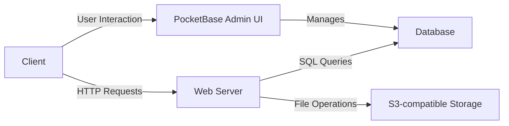

# Software Design Document: Web Gallery of Art

## 1. Introduction

This document outlines the software design for the Web Gallery of Art (WGA) project. The WGA is a web application that allows users to browse a collection of paintings, sculptures, and other forms of art. It aims to modernize the original Web Gallery of Art website by providing a responsive, user-friendly experience with the same rich content.

## 2. Technologies Used

The project leverages the following core technologies:

- **Backend:**
  - **Go (Golang):** Programming language used for the backend logic.
  - **PocketBase:** An open-source backend-as-a-service (BaaS) written in Go. It provides data persistence (SQLite database), real-time subscriptions, user authentication, an admin UI, and a REST-ish API.
- **Frontend:**
  - **htmx:** A JavaScript library that allows access to modern browser features directly from HTML, enabling dynamic page updates without complex JavaScript.
  - **TailwindCSS:** A utility-first CSS framework for rapidly building custom user interfaces.
  - **DaisyUI:** A component library for TailwindCSS that provides pre-styled components.
  - **Templ:** A Go library for writing HTML components and pages using Go syntax, which are then compiled into optimized Go code.
  - **TypeScript/JavaScript:** Used for custom client-side enhancements and interactions (`resources/js/app.ts`).
- **Build & Development Tools:**
  - **Bun:** A fast JavaScript all-in-one toolkit used for managing frontend dependencies, running scripts, and bundling assets.
  - **Goreleaser:** A tool for building and releasing Go applications.
  - **Docker:** Defines a container image build for the application.
  - **Mise:** Manages pinned development tools, environment defaults, and project tasks.
- **External Services:**
  - **S3-compatible storage:** Used for storing images and other large assets.
  - **SMTP Service:** For sending emails (e.g., postcards, notifications).

## 3. System Architecture

### 3.1. Overview

The system follows a client-server architecture:

```mermaid
graph LR
    Client[Client] -->|HTTP Requests| WebServer[Web Server]
    WebServer -->|SQL Queries| Database[Database]
    WebServer -->|File Operations| S3Storage[S3-compatible Storage]
    Admin[PocketBase Admin UI] -->|Manages| Database
    Client -->|User Interaction| Admin
```

- **Client (Web Browser):** Renders HTML pages served by the backend. Uses htmx for dynamic updates and JavaScript for enhancements.
- **Web Server (Go/PocketBase):**
  - Handles incoming HTTP requests.
  - Serves HTML pages generated by `templ`.
  - Interacts with the PocketBase framework for database operations, authentication, and other backend tasks.
  - Serves static assets (CSS, JS, images not on S3).
- **Database (SQLite via PocketBase):** Stores application data, including information about artists, artworks, users, guestbook entries, etc. PocketBase provides the interface to this database.
- **S3-compatible Storage:** Stores larger media files, primarily images of artworks.
- **PocketBase Admin UI:** A built-in web interface provided by PocketBase for managing collections (database schema), records, users, and system settings.

### 3.2. Backend

- **PocketBase:**
  - **Core Framework:** The application is built as a PocketBase executable. PocketBase handles the server lifecycle, request routing (extensible via Go), and provides core services.
  - **Data Persistence:** Manages the SQLite database, providing an ORM-like interface and migration tools. Collections are defined in the PocketBase Admin UI and can be interacted with through the Go application.
  - **Admin Interface:** Offers a web-based UI for managing data and system settings.
- **Request Handling (`internal/handlers/`):**
  - The `internal/handlers/` directory contains Go packages responsible for handling specific HTTP routes.
  - `internal/handlers/main.go` registers these route handlers with the PocketBase application.
  - Handlers fetch data through PocketBase, process it, and render HTML responses using `templ` templates.
- **Migrations (`internal/migrations/`):** Go files define schema changes and are registered with PocketBase's migration tool.
- **Background Tasks/Cronjobs (`internal/crontab/`):** Code for scheduled tasks is registered with PocketBase's cron scheduler.
- **Hooks (`internal/hooks/`):** Code responds to PocketBase lifecycle events.

### 3.3. Frontend

- **Templating (`internal/assets/templ/`):**
  - HTML pages and components are written as `.templ` files. These are Go functions that generate HTML.
  - The `templ generate` command compiles these files into Go code, which is then used by the request handlers to render responses.
  - Layouts (`internal/assets/templ/layouts/`) define the basic page structure, and components (`internal/assets/templ/components/`) are reusable UI elements.
- **Client-side Logic:**
  - **htmx:** Used extensively to enhance user interactions by making partial page updates. Attributes like `hx-get`, `hx-post`, `hx-target`, `hx-swap` are used in the HTML generated by `templ` to trigger server requests and update parts of the DOM.
  - **JavaScript (`resources/js/app.ts`):** Custom JavaScript (compiled from TypeScript) is used for functionalities that htmx doesn't cover, such as initializing third-party libraries (e.g., image viewers, rich text editors) or complex UI interactions.
- **Styling:**
  - **TailwindCSS:** Provides utility classes used directly in the `templ` files to style elements.
  - **DaisyUI:** Offers pre-built components (like buttons, cards, modals) that are styled with TailwindCSS, simplifying development.
  - Custom CSS is defined in `resources/css/style.pcss` and processed by PostCSS.

### 3.4. Asset Pipeline

- **Frontend Assets (`resources/`):**
  - `resources/js/app.ts`: Main TypeScript file for client-side scripting.
  - `resources/css/style.pcss`: Main PostCSS file for custom styles and TailwindCSS imports.
- **Build Process:**
  - `bun install`: Installs frontend dependencies.
  - `bun run build`: Compiles TypeScript to JavaScript and processes PostCSS/TailwindCSS.
  - `templ generate`: Compiles `.templ` files into Go code.
  - Built CSS and JavaScript are written to `internal/assets/public/` and embedded into the application.

## 4. Key Features and Modules

The application is organized into functional packages under `internal/handlers/`:

- **Landing:** Displays the main landing page.
- **Artists and Artworks:** Supports browsing, filtering, and viewing artist and artwork details.
- **Inspire:** Provides discovery views for artworks.
- **Postcards:** Creates and sends digital postcards featuring artworks.
- **Guestbook and Feedback:** Accepts visitor contributions.
- **Static Pages and Contributors:** Serves static content and contributor information.
- **Dual:** Renders paired artwork views.

## 5. Data Storage

### 5.1. Database

- **PocketBase (SQLite):** PocketBase uses an embedded SQLite database by default to store all application data.
- **Schema:** The database schema is defined and managed through PocketBase's Admin UI or via migration files (`internal/migrations/`). Key collections include:
  - `artists`: Information about artists.
  - `artworks`: Details about individual artworks.
  - `schools`: Art schools or movements.
  - `art_periods`: Historical art periods.
  - `forms`: Art forms (e.g., painting, sculpture).
  - `types`: Specific types of art.
  - `glossary`: Definitions of art terms.
  - `guestbook`: Entries from the guestbook.
  - `postcards`: Data for sent postcards.
  - `feedbacks`: User feedback submissions.
  - `static_pages`: Content for static pages.
  - `musics`: Information about musical pieces.
  - `users`: (Managed by PocketBase) For user accounts if authentication is used beyond admin.

### 5.2. File Storage

- **S3-compatible Object Storage:** Used for storing artwork images and potentially other large static assets. The application is configured with S3 credentials (`WGA_S3_*` environment variables).
- **Local `wga_data/storage`:** During local development or if S3 is not configured, PocketBase can store files locally in this directory.

## 6. Build, Testing, and Deployment

### 6.1. Local Development Setup

- **Prerequisites:** Mise installs the configured Go, Bun, and Templ versions from `mise.toml`.
- **Environment Variables:** A `.env` file is required in the process working directory. `mise run app:init-env` creates one in the repository root.
- **Services:** `mise run dev` starts local MinIO and MailHog alongside the asset and template watchers.
- **Running:**
  1.  `mise run app:init-env`
  2.  `mise run dev`
  3.  In a separate terminal, `mise run code:run`

### 6.2. Build Process

1.  **Build:** `mise run app:build`
    - Installs frontend dependencies.
    - Builds JavaScript and CSS assets.
    - Generates Go code from Templ sources and tidies Go modules.
    - Produces the application binary at `dist/wga`.
2.  **Release (using Goreleaser):** `goreleaser release` automates release builds and archives according to `.goreleaser.yaml`.

### 6.3. Testing

- **Unit Tests:** Go's standard testing package is used for backend logic (for example, `internal/crontab/postcard_test.go`).
- **End-to-End (E2E) Tests (`playwright-tests/`):**
  - Playwright (a Node.js library) is used for E2E testing.
  - Tests are written in TypeScript (e.g., `playwright-tests/artists.spec.ts`).
  - These tests simulate user interactions in a browser to verify application functionality.
- **Running Tests:**
  - Go tests: `go test ./... -cover`
  - Playwright tests: `bunx playwright test` after starting the application and configuring `WGA_PROTOCOL`, `WGA_HOSTNAME`, and `MAILPIT_URL`.

### 6.4. Deployment

- **Containerization:** `Dockerfile` is provided to build a Docker image of the application.
- **Hosting:** `fly.toml` indicates deployment to Fly.io.
- **Process:**
  1.  Build the Go binary and frontend assets.
  2.  Build a Docker image containing the application and its assets.
  3.  Push the Docker image to a registry.
  4.  Deploy the image to Fly.io (or other container hosting platform).
  - Goreleaser might also be involved in the deployment pipeline, potentially building and pushing Docker images.

## 7. Directory Structure

A brief overview of key directories:

- `.github/`: GitHub specific files (workflows, issue templates).
- `.vscode/`: VSCode editor settings.
- `cmd/wga/`: Application entry point.
- `internal/`: Application packages, including handlers, hooks, cron jobs, migrations, validation, repositories, and utilities.
- `internal/assets/`: Embedded assets, reference data, Templ sources, and view files.
- `docs/`: Project documentation.
- `playwright-tests/`: End-to-end tests.
- `resources/`: Source frontend assets (JS/TS, CSS/PCSS, MJML for emails).
- `go.mod`, `go.sum`: Go module files.
- `package.json`, `bun.lock`: Frontend dependency management.
- `mise.toml`: Development tools, tasks, and local services.
- `Dockerfile`: For building Docker images.
- `fly.toml`: Configuration for Fly.io deployment.
- `.goreleaser.yaml`: Configuration for Goreleaser releases.

This document provides a high-level overview of the Web Gallery of Art software design. For more detailed information, refer to the source code and specific configuration files.
