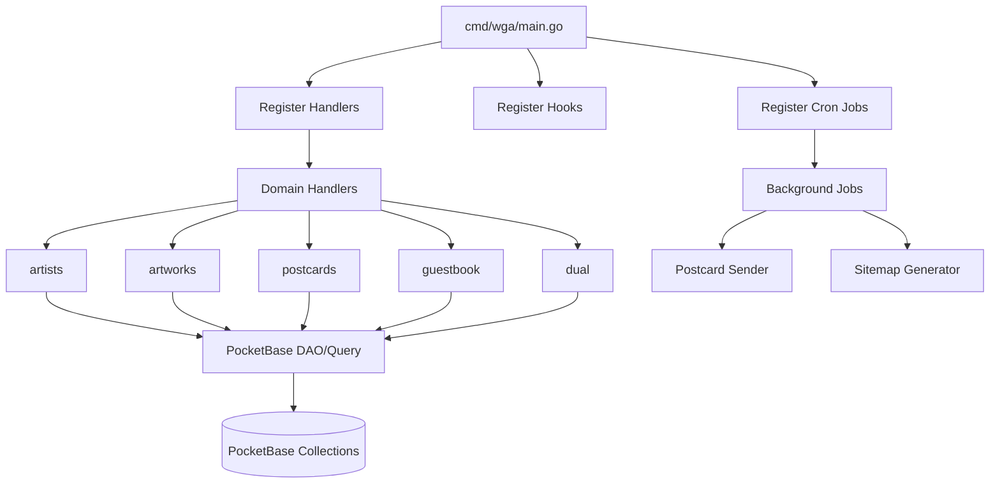
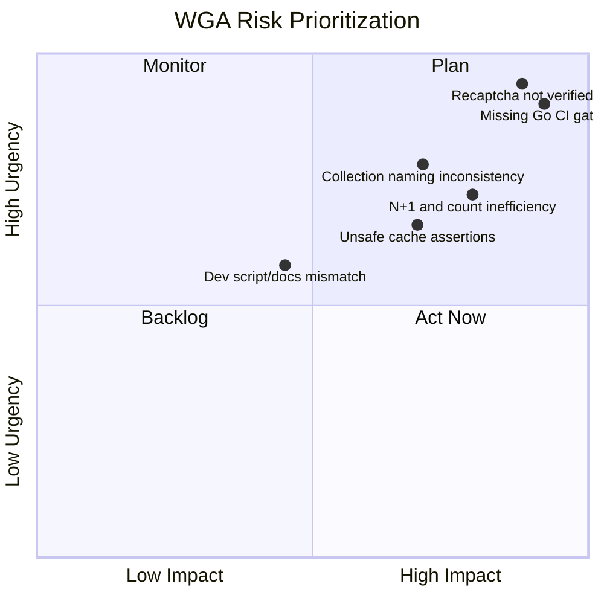
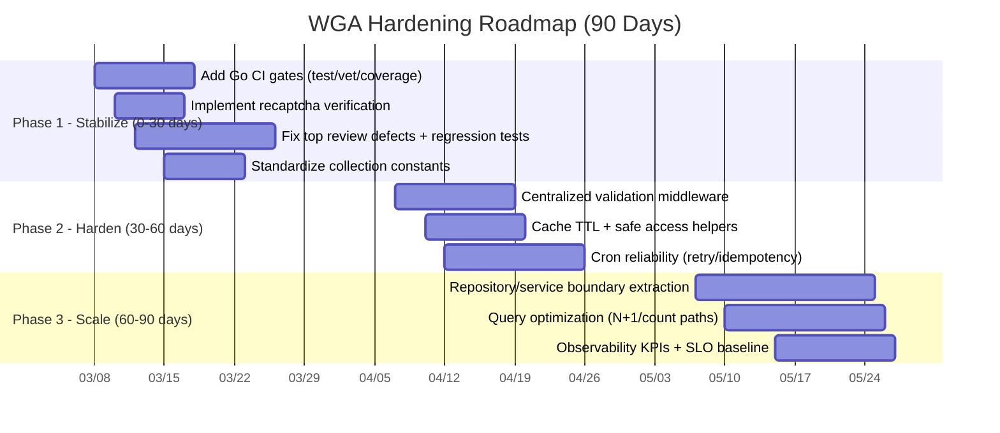

# WGA Project Executive Summary

**Date:** 2026-03-07  
**Repository:** `blackfyre/wga`  
**Branch Reviewed:** `feat-3-dual-mode`  
**Perspective:** Incoming senior/project lead with Go + PocketBase best-practice lens

## 1. Executive Assessment

WGA is a well-structured PocketBase-driven monolith with clear domain separation and a modern frontend stack. The project is in a strong feature-delivery position, but its current quality gates and backend safety controls are not yet at the maturity needed for reliable scale.

The codebase does not require a rewrite. It requires disciplined hardening in three areas:

1. Delivery confidence (CI gates + tests)
2. Security and correctness (form validation, collection consistency, error handling)
3. Performance and maintainability (query patterns, cache policy, abstraction boundaries)

## 1.1 Execution Update (2026-03-07)

### Completed now

1. CI gates strengthened:

- Added `go vet ./...` and `go test ./... -cover` in `.github/workflows/playwright.yml`.
- Added backend quality gate job in `.github/workflows/pr-validation.yml`.

2. Security hardening:

- Implemented server-side reCAPTCHA verification in `internal/handlers/postcards/save.go`.
- Added verification helper and tests in `internal/handlers/postcards/recaptcha.go` and `internal/handlers/postcards/recaptcha_test.go`.

3. Collection identifier standardization:

- Added `internal/constants/collections.go` and migrated key handlers to constants.

4. High-priority dual-mode defect fixes:

- Fixed `HX-Push-Url` query parameter construction.
- Fixed default left pane rendering behavior and added regression tests.

### Remaining from the full 90-day plan

1. Centralized validation middleware.
2. Broader N+1/query optimization sweep.
3. Cache TTL/invalidation strategy.
4. Expanded package-level unit test coverage beyond current critical-path additions.

## 2. Current State Snapshot

### Strengths

1. Clear feature package boundaries under `internal/handlers/*`.
2. Idiomatic PocketBase wiring in `cmd/wga/main.go`.
3. Practical tooling stack: Templ + Bun + PostCSS + Playwright.
4. Automated release/deployment pipeline already in place.
5. Existing technical review culture (`docs/go-code-review.md`).

### Key Gaps

1. CI does not gate backend quality with `go test`/`go vet`.
2. Security control incomplete: reCAPTCHA token collected but not server-verified.
3. Inconsistent collection identifiers (e.g. `Guestbook` vs lowercase conventions).
4. Query inefficiencies (count via full fetch, known N+1 patterns).
5. Cache strategy lacks TTL/invalidation discipline and uses unsafe type assertions.
6. Dev UX drift between docs and scripts (`bun run dev` documented but missing).

## 3. System Overview

## 4. Risk Matrix

## 5. Findings and Recommendations

### 5.1 Delivery and Quality Gates

**Observed**

- `.github/workflows/playwright.yml` focuses on build + E2E but does not run `go test ./...` or `go vet ./...`.
- `.github/workflows/pr-validation.yml` validates PR title only.
- Only 3 Go unit test files currently exist.

**Recommendation**

1. Add mandatory backend quality gates on PR: `go test ./...`, `go vet ./...`, and coverage reporting.
2. Keep Playwright as integration gate; add a small smoke subset for fast PR feedback.
3. Add failure policy: merge blocked unless backend + frontend checks pass.

### 5.2 Security and Data Integrity

**Observed**

- `internal/handlers/postcards/save.go` captures `RecaptchaToken`, but no server-side verification call is present.
- Repeated anti-bot checks are handler-local instead of centralized.
- Collection IDs are not uniformly managed.

**Recommendation**

1. Implement server-side reCAPTCHA verification before save.
2. Centralize validation middleware (honeypot + email/form rules).
3. Introduce collection constants package to eliminate string drift.
4. Standardize user-safe error responses and internal structured logging.

### 5.3 Performance and Scalability

**Observed**

- Record counts in list pages use full record retrieval patterns.
- Known N+1 concerns are already documented in `docs/go-code-review.md`.
- Cache entries are stored without TTL and rely on direct type assertions.

**Recommendation**

1. Replace full-fetch counting with aggregate count query strategy.
2. Remove N+1 via prefetch/join-style data loading where applicable.
3. Add cache helper functions with safe type retrieval and TTL semantics.
4. Add baseline metrics: request latency, DB query counts, cron failures.

### 5.4 Architecture and Maintainability

**Observed**

- Handlers are clear but some contain mixed responsibilities (query parsing, data access, DTO assembly, render).
- Utility package responsibilities are broad and somewhat overlapping.

**Recommendation**

1. Introduce a thin repository/service layer for frequently reused data access logic.
2. Split large handlers into focused components:
   - request parsing/validation
   - data retrieval
   - DTO mapping
   - response rendering
3. Consolidate duplicated URL and helper behaviors into single authoritative implementations.

## 6. 90-Day Leadership Plan

## 7. Success Metrics

1. CI reliability:

- 100% PRs run backend and frontend gates.
- Mean CI runtime under agreed threshold while preserving quality.

2. Quality:

- Unit test coverage trend increasing month-over-month for critical packages.
- Regression defects from known issues reduced to zero in new releases.

3. Security:

- 100% postcard submissions require valid server-verified reCAPTCHA.
- No sensitive internal error leakage in client-facing responses.

4. Performance:

- Reduced query count and improved p95 latency on artist/artwork list endpoints.
- Cron delivery jobs observable with explicit failure alerts and retry outcomes.

## 8. Leadership Recommendation

Proceed with feature work, but gate all new delivery behind Phase 1 hardening standards immediately. This will improve stability and trust without slowing the roadmap materially.

The project is strategically healthy and can scale with targeted engineering governance rather than structural upheaval.
