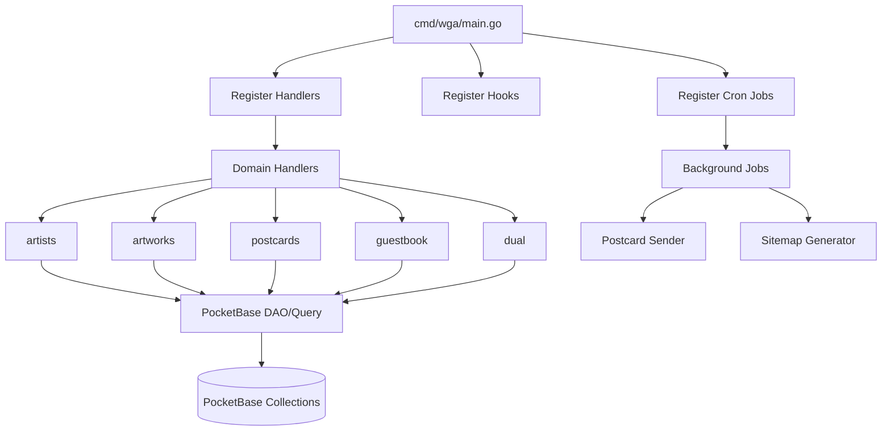
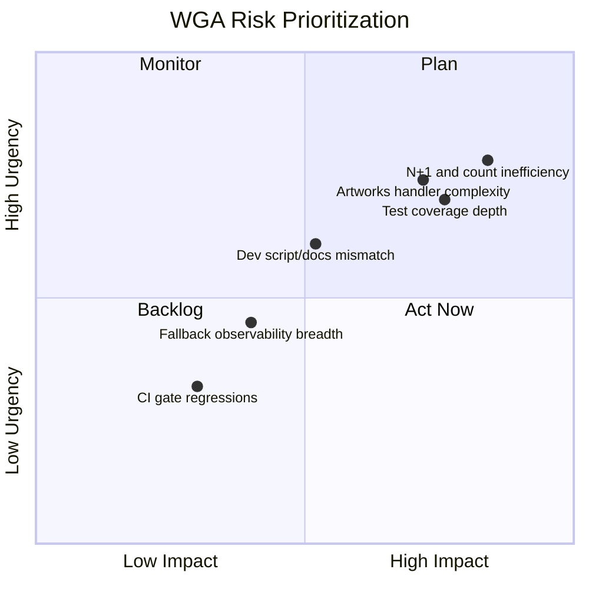
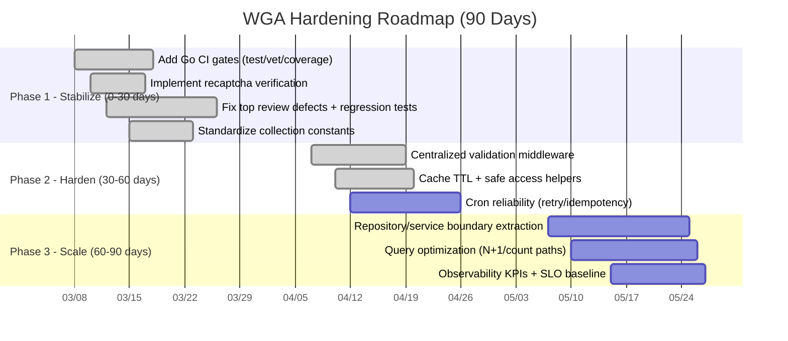

# WGA Project Executive Summary

**Date:** 2026-03-07  
**Repository:** `blackfyre/wga`  
**Branch Reviewed:** `feat-3-dual-mode`  
**Perspective:** Incoming senior/project lead with Go + PocketBase best-practice lens

## 1. Executive Assessment

WGA is a well-structured PocketBase-driven monolith with clear domain separation and a modern frontend stack. The project is in a strong feature-delivery position, but its current quality gates and backend safety controls are not yet at the maturity needed for reliable scale.

The codebase does not require a rewrite. It requires disciplined hardening in three areas:

1. Delivery confidence (CI gates + tests)
2. Security and correctness (form validation, collection consistency, error handling)
3. Performance and maintainability (query patterns, cache policy, abstraction boundaries)

## 1.1 Execution Update (2026-03-07)

### Completed now

1. CI gates strengthened:

- Added `go vet ./...` and `go test ./... -cover` in `.github/workflows/playwright.yml`.
- Added backend quality gate job in `.github/workflows/pr-validation.yml`.

2. Security hardening:

- Implemented server-side reCAPTCHA verification in `internal/handlers/postcards/save.go`.
- Added verification helper and tests in `internal/handlers/postcards/recaptcha.go` and `internal/handlers/postcards/recaptcha_test.go`.

3. Collection identifier standardization:

- Added `internal/constants/collections.go` and migrated key handlers to constants.

4. High-priority dual-mode defect fixes:

- Fixed `HX-Push-Url` query parameter construction.
- Fixed default left pane rendering behavior and added regression tests.

5. Centralized form validation:

- Added shared validation helpers in `internal/validation/forms.go`.
- Migrated `guestbook`, `feedback`, and `postcards` handlers to shared validation checks.

6. Cache safety and TTL strategy:

- Added typed cache helpers with TTL support in `internal/utils/cache.go`.
- Migrated landing and contributors cache access away from unsafe type assertions.

7. Repository/service boundary extraction (initial):

- Added `internal/repositories/landing.go` and refactored landing handler data access.
- Added `internal/repositories/contributors.go` and refactored contributors handler data flow.

8. Fallback observability:

- Added contributors source tracking (`cache`, `api`, `file_fallback`).
- Exposed runtime source in `X-WGA-Contributors-Source` response header.

### Remaining from the full 90-day plan

1. Broader N+1/query optimization sweep.
2. Secondary documentation cleanup after the contributor-doc alignment milestone.
3. Deeper repository extraction for high-churn handlers (especially artworks search).
4. Expanded package-level unit test coverage beyond current critical-path additions.
5. Baseline KPIs/SLO instrumentation beyond contributors fallback source metadata.

## 2. Current State Snapshot

### Strengths

1. Clear feature package boundaries under `internal/handlers/*`.
2. Idiomatic PocketBase wiring in `cmd/wga/main.go`.
3. Practical tooling stack: Templ + Bun + PostCSS + Playwright.
4. Automated release/deployment pipeline already in place.
5. Existing technical review culture (`docs/go-code-review.md`).

### Key Gaps

1. Query inefficiencies (count via full fetch, known N+1 patterns).
2. Secondary repo-analysis docs needed cleanup after the contributor-doc alignment milestone corrected the active workflow guidance.
3. Architecture split is still partial; large handlers (notably artworks) remain mixed-responsibility.
4. Automated test depth remains shallow in many backend domains.

### Recently Mitigated

1. Backend CI quality gates are now in place (`go vet` + `go test`).
2. reCAPTCHA server-side verification is implemented for postcard submission.
3. Runtime collection identifier drift has been standardized via `internal/constants/collections.go`.
4. Shared validation checks now replace duplicated honeypot/message/captcha-required logic.
5. Typed cache access + TTLs now protect against panic-prone store assertions.
6. Contributors fallback behavior is now visible in logs and response metadata.

## 3. System Overview

## 4. Risk Matrix

## 5. Findings and Recommendations

### 5.1 Delivery and Quality Gates

**Observed**

- Backend quality gates (`go vet`, `go test`) are now integrated into CI workflows.
- PR title validation remains in place as a lightweight policy gate.
- Unit test footprint is improving but remains thin in multiple business-critical handler packages.

**Recommendation**

1. Maintain mandatory backend gates and add coverage trend reporting.
2. Keep Playwright as integration gate; add a small smoke subset for fast PR feedback.
3. Add explicit merge policy requiring both backend and frontend checks.

### 5.2 Security and Data Integrity

**Observed**

- `postcards` now enforces server-side reCAPTCHA verification.
- Core anti-bot/message/captcha-required validation checks are centralized.
- Runtime collection IDs are standardized through constants.

**Recommendation**

1. Extend centralized validation to future/new form endpoints by default.
2. Continue to standardize user-safe error responses and internal structured logging.
3. Add periodic audit checks to ensure new handlers use shared validation and constants.

### 5.3 Performance and Scalability

**Observed**

- Record counts in list pages use full record retrieval patterns.
- Known N+1 concerns are already documented in `docs/go-code-review.md`.
- Cache entries in critical paths now use typed helper access and TTL metadata.

**Recommendation**

1. Replace full-fetch counting with aggregate count query strategy.
2. Remove N+1 via prefetch/join-style data loading where applicable.
3. Expand cache helper adoption to additional read-heavy paths where appropriate.
4. Add baseline metrics: request latency, DB query counts, cron failures.

### 5.4 Architecture and Maintainability

**Observed**

- Handlers are clear but some remain mixed-responsibility (query parsing, data access, DTO assembly, render).
- Initial repository boundaries are now in place for landing and contributors.

**Recommendation**

1. Continue repository/service extraction for high-churn handlers (especially artworks search).
2. Split large handlers into focused components:
   - request parsing/validation
   - data retrieval
   - DTO mapping
   - response rendering
3. Consolidate duplicated URL and helper behaviors into single authoritative implementations.

## 6. 90-Day Leadership Plan

## 7. Success Metrics

1. CI reliability:

- 100% PRs run backend and frontend gates.
- Mean CI runtime under agreed threshold while preserving quality.

2. Quality:

- Unit test coverage trend increasing month-over-month for critical packages.
- Regression defects from known issues reduced to zero in new releases.

3. Security:

- 100% postcard submissions require valid server-verified reCAPTCHA.
- No sensitive internal error leakage in client-facing responses.

4. Performance:

- Reduced query count and improved p95 latency on artist/artwork list endpoints.
- Cron delivery jobs observable with explicit failure alerts and retry outcomes.

## 8. Leadership Recommendation

Proceed with feature work, but gate all new delivery behind Phase 1 hardening standards immediately. This will improve stability and trust without slowing the roadmap materially.

The project is strategically healthy and can scale with targeted engineering governance rather than structural upheaval.
